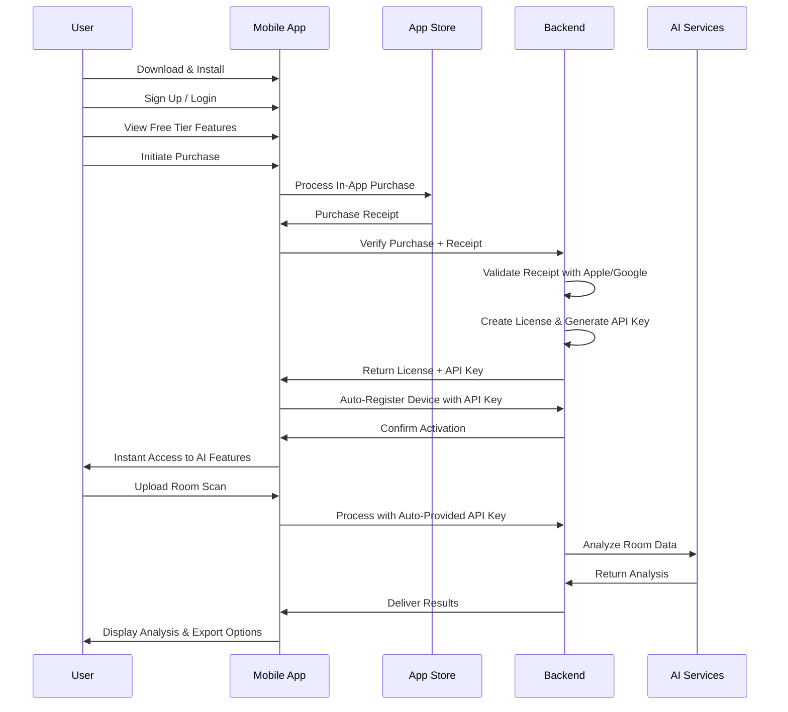

# 🔌 Room-O-Matic Backend Requirements for Mobile Frontend Integration

## 📋 Executive Summary

This document outlines the comprehensive backend API requirements needed to support the Room-O-Matic Mobile frontend after all planned development phases are completed. The mobile app implements a **purchase-to-activation business model** with automatic license provisioning, requiring sophisticated user account management, in-app purchase verification, and seamless API key generation.

**Document Version**: 1.0
**Target Completion**: Post Phase 5.1-9 Implementation
**Business Model**: Purchase-to-Activation with Automatic License Provisioning
**Integration Pattern**: Account-Based Configuration (No Manual API Keys)

---

## 🎯 Core Business Requirements

### Purchase-to-Activation Flow


### User Experience Requirements
- **Seamless Onboarding**: Download → Signup → Purchase → Instant Activation
- **No Manual Configuration**: Automatic API key provisioning and device registration
- **Free Tier Experience**: Limited functionality with clear upgrade prompts
- **Account-Based Access**: Multi-device synchronization with single purchase
- **Offline-First Design**: Full functionality without internet, enhanced features with server

---

## 🏗️ API Architecture Requirements

### API Endpoint Structure
The backend must implement the complete mobile API specification as documented in `API_ENDPOINTS.md`. Key endpoint categories include:

#### User Authentication & Account Management
- User registration with email/password and OAuth (Google/Apple)
- JWT-based authentication with refresh token support
- Account profile management and preferences
- Multi-device account synchronization

#### Purchase & License Management
- In-app purchase receipt verification (iOS/Android)
- Automatic license creation and API key generation
- License status monitoring and renewal
- Quota tracking and usage analytics

#### Room Processing & AI Services
- Room scan upload with multi-sensor data support
- Real-time processing status with WebSocket notifications
- AI analysis integration with multiple providers
- Result caching and retrieval with export formats

#### Mobile-Specific Features
- Device registration and capability detection
- Background upload queue management
- Offline data synchronization
- Push notification support for processing completion

---

## 💾 Data Model Requirements

### User Account System

#### User Entity
```typescript
interface User {
  id: string;                    // UUID primary key
  email: string;                 // Unique, validated email
  email_verified: boolean;       // Email verification status
  password_hash: string;         // Bcrypt hashed password
  oauth_providers: OAuthProvider[]; // Google/Apple OAuth data
  created_at: Date;
  updated_at: Date;
  last_login: Date;
  account_status: 'active' | 'suspended' | 'deleted';

  // Profile Information
  first_name?: string;
  last_name?: string;
  profile_image_url?: string;
  timezone?: string;
  locale?: string;

  // Subscription & License
  subscription_tier: 'free' | 'basic' | 'professional' | 'enterprise';
  subscription_status: 'active' | 'expired' | 'cancelled';
  subscription_expires_at?: Date;

  // Usage Tracking
  quota_limit: number;           // API calls per period
  quota_used: number;            // Current period usage
  quota_reset_date: Date;        // When quota resets

  // Mobile App Specific
  mobile_permissions: MobilePermissions;
  push_notification_token?: string;
  app_version?: string;
  platform?: 'ios' | 'android';
}
```

#### License & API Key Management
```typescript
interface License {
  id: string;                    // UUID primary key
  user_id: string;              // Foreign key to User
  license_type: 'mobile_app' | 'wordpress_plugin' | 'api_access';
  license_key: string;          // Unique license identifier
  api_key: string;              // Generated API key (romo_live_xxx)

  // Purchase Information
  purchase_receipt: string;      // App Store/Play Store receipt
  purchase_transaction_id: string;
  purchase_original_transaction_id: string;
  purchase_platform: 'ios' | 'android' | 'web';
  purchase_amount: number;
  purchase_currency: string;
  purchase_date: Date;

  // License Status
  status: 'active' | 'expired' | 'revoked' | 'refunded';
  activated_at: Date;
  expires_at?: Date;            // Null for lifetime licenses

  // Device Registration
  registered_devices: DeviceRegistration[];
  max_devices: number;          // Device limit for this license

  // Usage Tracking
  api_calls_used: number;
  processing_jobs_used: number;
  last_used_at: Date;

  created_at: Date;
  updated_at: Date;
}
```

#### Device Registration
```typescript
interface DeviceRegistration {
  id: string;                    // UUID primary key
  license_id: string;           // Foreign key to License
  device_id: string;            // Unique device identifier
  device_name: string;          // User-friendly device name
  platform: 'ios' | 'android';
  os_version: string;
  app_version: string;
  device_model: string;

  // Registration Status
  status: 'active' | 'revoked';
  registered_at: Date;
  last_seen_at: Date;

  // Device Capabilities
  has_lidar: boolean;
  has_tof_sensor: boolean;
  camera_capabilities: CameraCapabilities;
  audio_capabilities: AudioCapabilities;

  created_at: Date;
  updated_at: Date;
}
```

### Room Scanning & Processing

#### Room Scan Entity
```typescript
interface RoomScan {
  id: string;                    // UUID primary key
  user_id: string;              // Foreign key to User
  device_id: string;            // Foreign key to DeviceRegistration

  // Room Information
  room_name: string;
  room_type: string;            // living_room, bedroom, kitchen, etc.
  scan_duration: number;        // Seconds

  // Sensor Data (Binary/Compressed)
  lidar_data?: Buffer;          // LiDAR point cloud data
  audio_sonar_data?: Buffer;    // Chiroptera ultrasonic measurements
  camera_frames?: Buffer[];     // Camera images/video frames
  motion_data?: Buffer;         // Accelerometer/gyroscope/magnetometer
  location_data?: Buffer;       // GPS and indoor positioning data

  // Scan Metadata
  scan_quality: number;         // Quality score 0-1
  lighting_conditions: string;  // bright, dim, mixed, artificial, natural
  ambient_noise_level: number;  // dB level during scan
  device_orientation: string;   // Portrait, landscape, etc.

  // Processing Status
  processing_status: 'pending' | 'queued' | 'processing' | 'completed' | 'failed';
  processing_id?: string;       // Reference to processing job
  processing_provider?: string; // openai, anthropic, local, etc.
  processing_cost?: number;     // Cost in USD
  processing_started_at?: Date;
  processing_completed_at?: Date;
  processing_error?: string;

  // Export & Sharing
  export_formats: string[];     // json, pdf, csv, obj, ply
  shared_with?: string[];       // User IDs who have access

  created_at: Date;
  updated_at: Date;
  deleted_at?: Date;            // Soft delete
}
```

#### AI Analysis Results
```typescript
interface AIAnalysisResult {
  id: string;                    // UUID primary key
  room_scan_id: string;         // Foreign key to RoomScan
  processing_id: string;        // Unique processing job ID

  // Analysis Results
  room_dimensions: {
    width: number;              // meters
    length: number;             // meters
    height: number;             // meters
    area: number;               // square meters
    volume: number;             // cubic meters
    perimeter: number;          // meters
  };

  // Object Detection
  detected_objects: DetectedObject[];
  furniture_layout: FurnitureItem[];

  // Room Analysis
  room_classification: {
    primary_type: string;       // living_room, bedroom, etc.
    confidence: number;         // 0-1
    sub_classifications: string[];
  };

  // Spatial Analysis
  spatial_features: {
    doorways: Doorway[];
    windows: Window[];
    built_ins: BuiltIn[];
    electrical_outlets: Outlet[];
  };

  // Recommendations
  optimization_suggestions: Recommendation[];
  layout_improvements: LayoutSuggestion[];
  accessibility_notes: AccessibilityNote[];

  // Quality Metrics
  analysis_confidence: number;   // Overall confidence 0-1
  data_completeness: number;     // How complete the scan data was
  processing_time: number;       // Seconds

  // 3D Model Data
  mesh_data?: Buffer;           // 3D mesh file (OBJ, PLY)
  texture_data?: Buffer;        // Texture maps
  model_format: string;         // obj, ply, gltf, etc.
  model_url?: string;           // CDN URL for 3D model download

  created_at: Date;
}
```

### Processing Queue & Job Management

#### Processing Job
```typescript
interface ProcessingJob {
  id: string;                    // UUID primary key
  user_id: string;              // Foreign key to User
  room_scan_id: string;         // Foreign key to RoomScan

  // Job Configuration
  job_type: 'ai_analysis' | 'mesh_generation' | 'export_conversion';
  priority: number;             // 1-10, higher = more priority
  ai_provider: string;          // openai, anthropic, local
  processing_options: ProcessingOptions;

  // Status Tracking
  status: 'queued' | 'processing' | 'completed' | 'failed' | 'cancelled';
  progress: number;             // 0-100 percentage
  queue_position?: number;      // Position in queue

  // Timing
  queued_at: Date;
  started_at?: Date;
  completed_at?: Date;
  estimated_completion?: Date;
  processing_time?: number;     // Actual processing time in seconds

  // Resource Usage
  cost_estimate: number;        // Estimated cost in USD
  cost_actual?: number;         // Actual cost after completion
  tokens_used?: number;         // AI tokens consumed
  compute_time?: number;        // Compute seconds used

  // Error Handling
  error_message?: string;
  retry_count: number;
  max_retries: number;

  // Result References
  result_id?: string;           // Foreign key to AIAnalysisResult
  output_files: string[];       // URLs to generated files

  created_at: Date;
  updated_at: Date;
}
```

---

## 🔐 Authentication & Security Requirements

### JWT Token Management
```typescript
interface JWTPayload {
  sub: string;                   // User ID
  iat: number;                   // Issued at timestamp
  exp: number;                   // Expiration timestamp
  device_id?: string;            // For mobile device tokens
  api_key?: string;              // Associated API key
  permissions: string[];         // User permissions array
  subscription_tier: string;     // User's subscription level
  license_id?: string;           // Associated license
}
```

### API Key Generation & Validation
- **Format**: `romo_live_` + 32 character alphanumeric string
- **Uniqueness**: Cryptographically secure random generation
- **Storage**: Hashed in database with salt
- **Scoping**: Per-device registration with permission sets
- **Rotation**: Automatic rotation on security events

### Permission System
```typescript
interface MobilePermissions {
  mobile_app_access: boolean;           // Basic mobile app API access
  mobile_upload_enabled: boolean;       // Upload room scans
  mobile_processing_enabled: boolean;   // Process scans via AI
  mobile_export_enabled: boolean;       // Export and download results
  mobile_background_upload: boolean;    // Background upload queue
  mobile_offline_sync: boolean;         // Offline data sync
  mobile_push_notifications: boolean;   // Push notification access
  mobile_real_time_processing: boolean; // Real-time processing updates
}
```

---

## 🛒 In-App Purchase Integration

### Purchase Receipt Verification

#### iOS App Store Integration
- **Receipt Validation**: Integration with Apple's App Store Server API
- **Transaction Verification**: Validate original transaction IDs
- **Subscription Management**: Handle subscription renewals and cancellations
- **Refund Handling**: Process refund notifications and license revocation

#### Android Play Store Integration
- **Purchase Token Validation**: Integration with Google Play Developer API
- **Subscription Tracking**: Monitor subscription status and renewals
- **Purchase Acknowledgment**: Acknowledge purchases to prevent refunds
- **Real-time Developer Notifications**: Handle subscription state changes

### Product Catalog Management
```typescript
interface Product {
  id: string;                    // Product identifier
  platform: 'ios' | 'android' | 'universal';
  product_type: 'consumable' | 'non_consumable' | 'subscription';

  // Store Information
  store_product_id: string;      // App Store/Play Store product ID
  price: number;                 // Price in local currency
  currency: string;              // Currency code

  // License Configuration
  license_type: string;          // Type of license granted
  license_duration?: number;     // Duration in days (null for lifetime)
  quota_limit: number;           // API quota granted
  device_limit: number;          // Max devices per license

  // Feature Access
  features_granted: string[];    // List of features unlocked
  ai_provider_access: string[];  // AI providers available

  // Metadata
  title: string;
  description: string;
  benefits: string[];

  active: boolean;
  created_at: Date;
  updated_at: Date;
}
```

---

## 📊 Usage Analytics & Quota Management

### Quota Tracking System
```typescript
interface UsageRecord {
  id: string;                    // UUID primary key
  user_id: string;              // Foreign key to User
  license_id: string;           // Foreign key to License
  device_id?: string;           // Foreign key to DeviceRegistration

  // Usage Metrics
  api_endpoint: string;          // Specific API endpoint called
  request_timestamp: Date;
  response_time: number;         // Response time in milliseconds
  tokens_consumed?: number;      // AI tokens used
  processing_cost?: number;      // Cost incurred

  // Request Metadata
  request_size: number;          // Request payload size in bytes
  response_size: number;         // Response payload size in bytes
  user_agent: string;            // Client user agent
  ip_address: string;            // Request IP address

  // Status
  status_code: number;           // HTTP status code
  error_message?: string;        // Error details if failed

  created_at: Date;
}
```

### Analytics Dashboard Data
- **Real-time Usage Monitoring**: Current API calls, processing jobs, costs
- **Historical Trends**: Usage patterns over time, peak usage periods
- **Performance Metrics**: Average response times, error rates, success rates
- **Cost Analytics**: Cost per user, per feature, per time period
- **Device Analytics**: Usage by device type, platform, app version

---

## 🔄 Real-Time Features & WebSockets

### WebSocket Endpoints
```typescript
// Processing Status Updates
ws://api.room-o-matic.com/v1/mobile/processing/{processing_id}/stream

// User Notifications
ws://api.room-o-matic.com/v1/mobile/notifications

// Real-time Analytics
ws://api.room-o-matic.com/v1/mobile/analytics/live
```

### Real-Time Event Types
```typescript
interface ProcessingStatusEvent {
  type: 'processing_status_update';
  processing_id: string;
  status: string;
  progress: number;
  estimated_completion?: Date;
  error_message?: string;
}

interface NotificationEvent {
  type: 'notification';
  notification_type: 'processing_complete' | 'quota_warning' | 'license_expiring';
  title: string;
  message: string;
  action_url?: string;
  metadata: Record<string, any>;
}

interface AnalyticsEvent {
  type: 'analytics_update';
  metric_type: 'quota_usage' | 'processing_queue' | 'system_status';
  value: number;
  timestamp: Date;
  metadata: Record<string, any>;
}
```

---

## 📱 Mobile-Specific API Requirements

### Device Capability Detection
```typescript
interface DeviceCapabilities {
  // Hardware Sensors
  has_lidar: boolean;
  has_tof_sensor: boolean;
  has_depth_camera: boolean;
  accelerometer_available: boolean;
  gyroscope_available: boolean;
  magnetometer_available: boolean;

  // Camera Capabilities
  camera_resolution: string;     // 1080p, 4K, etc.
  has_wide_angle_camera: boolean;
  has_ultra_wide_camera: boolean;
  supports_60fps_video: boolean;

  // Audio Capabilities
  microphone_available: boolean;
  speaker_available: boolean;
  supports_ultrasonic: boolean;
  max_sample_rate: number;

  // Processing Power
  cpu_cores: number;
  available_memory: number;      // MB
  gpu_type: string;

  // Software Features
  ar_framework: string;          // ARKit, ARCore, none
  platform_version: string;     // iOS 17.0, Android 14, etc.
  app_version: string;
}
```

### Background Processing Support
- **Upload Queue Management**: Handle uploads when app is backgrounded
- **Processing Notifications**: Push notifications for completed processing
- **Offline Sync**: Sync data when network becomes available
- **Background Refresh**: Update license status and quota information

---

## 🗄️ Data Storage & Export Requirements

### Multi-Format Export System
The mobile app supports multiple export formats that require backend processing:

#### JSON Export (Structured Data)
```json
{
  "room_scan": {
    "metadata": { /* scan metadata */ },
    "sensor_data": { /* processed sensor data */ },
    "analysis_results": { /* AI analysis */ },
    "measurements": { /* room dimensions */ }
  },
  "export_metadata": {
    "generated_at": "2025-09-14T18:30:00Z",
    "format_version": "1.0",
    "units": "metric"
  }
}
```

#### PDF Export (Formatted Reports)
- **Professional Reports**: Room measurements with diagrams
- **3D Visualizations**: Rendered room models and floor plans
- **Analysis Summary**: AI recommendations and insights
- **Custom Branding**: User-configurable report templates

#### CSV Export (Tabular Data)
- **Measurement Data**: Point clouds, distances, areas, volumes
- **Object Detection**: Detected items with positions and confidence
- **Sensor Readings**: Raw and processed sensor data
- **Time Series**: Data captured over scan duration

### File Storage & CDN Requirements
- **Large File Support**: Room scans can exceed 100MB with full sensor data
- **CDN Integration**: Fast global access to 3D models and exports
- **Compression**: Efficient storage of binary sensor data
- **Retention Policies**: Configurable data retention based on subscription tier

---

## 🔔 Push Notification System

### Notification Types & Templates
```typescript
interface NotificationTemplate {
  type: 'processing_complete' | 'processing_failed' | 'quota_warning' |
        'license_expiring' | 'feature_announcement' | 'security_alert';

  // iOS APNS Configuration
  apns_payload: {
    aps: {
      alert: {
        title: string;
        body: string;
      };
      badge?: number;
      sound?: string;
      category?: string;
    };
    custom_data: Record<string, any>;
  };

  // Android FCM Configuration
  fcm_payload: {
    notification: {
      title: string;
      body: string;
      icon?: string;
      color?: string;
    };
    data: Record<string, any>;
    android: {
      priority: 'high' | 'normal';
      notification: {
        channel_id: string;
        importance: string;
      };
    };
  };
}
```

### Push Notification Triggers
- **Processing Complete**: Room analysis finished with results available
- **Processing Failed**: Error occurred during processing with retry options
- **Quota Warning**: User approaching monthly quota limit
- **License Expiring**: Subscription expiring soon with renewal prompts
- **Feature Updates**: New features available or app updates required

---

## 🛡️ Security & Compliance Requirements

### Data Protection
- **Encryption at Rest**: AES-256 encryption for all sensitive data
- **Encryption in Transit**: TLS 1.3 for all API communications
- **Data Anonymization**: Remove personally identifiable information from sensor data
- **Right to Deletion**: Complete data removal upon user request

### Privacy Compliance
- **GDPR Compliance**: European data protection regulations
- **CCPA Compliance**: California consumer privacy act requirements
- **Data Minimization**: Collect only necessary data for functionality
- **Consent Management**: Granular consent for data collection and processing

### Security Monitoring
- **Intrusion Detection**: Monitor for suspicious API access patterns
- **Rate Limiting**: Prevent abuse with intelligent rate limiting
- **Audit Logging**: Comprehensive logging of all data access and modifications
- **Vulnerability Scanning**: Regular security assessments and penetration testing

---

## 📈 Performance & Scalability Requirements

### API Performance Targets
- **Response Time**: 95% of requests under 200ms for standard endpoints
- **Upload Performance**: Support for 100MB+ file uploads with resumability
- **Concurrent Processing**: Handle 1000+ simultaneous room processing jobs
- **Database Performance**: Sub-100ms query times for user data retrieval

### Scalability Requirements
- **Horizontal Scaling**: Auto-scaling based on processing queue length
- **Database Scaling**: Read replicas for improved query performance
- **CDN Integration**: Global content delivery for 3D models and exports
- **Caching Strategy**: Redis caching for frequently accessed data

### Infrastructure Requirements
- **Cloud Provider**: AWS, Google Cloud, or Azure with mobile-optimized regions
- **Container Orchestration**: Kubernetes for microservices deployment
- **Message Queues**: RabbitMQ or AWS SQS for processing job management
- **Monitoring**: Comprehensive monitoring with Prometheus/Grafana

---

## 🧪 Testing & Quality Assurance

### API Testing Requirements
- **Unit Tests**: 90%+ code coverage for all business logic
- **Integration Tests**: End-to-end API workflow testing
- **Load Testing**: Performance testing under expected user loads
- **Security Testing**: Penetration testing and vulnerability assessments

### Mobile Integration Testing
- **Device Testing**: Testing with actual iOS and Android devices
- **Network Conditions**: Testing under various network speeds and reliability
- **Background Testing**: Verify background upload and sync functionality
- **Purchase Testing**: In-app purchase flows with test accounts

---

## 🚀 Deployment & DevOps Requirements

### Environment Management
- **Development**: Local development with Docker containers
- **Staging**: Production-like environment for integration testing
- **Production**: High-availability production deployment
- **DR Environment**: Disaster recovery setup with data replication

### CI/CD Pipeline
- **Automated Testing**: Run full test suite on every commit
- **Database Migrations**: Automated schema migrations with rollback capability
- **Blue-Green Deployment**: Zero-downtime deployments
- **Feature Flags**: Toggle features without code deployment

### Monitoring & Observability
- **Application Monitoring**: APM tools for performance monitoring
- **Error Tracking**: Centralized error logging and alerting
- **Business Metrics**: Key business metric dashboards
- **User Analytics**: User behavior and feature usage analytics

---

## 📋 Implementation Checklist

### Phase 1: Foundation (Immediate Requirements)
- [ ] User account management system
- [ ] JWT authentication with refresh tokens
- [ ] Basic API endpoint structure
- [ ] Database schema implementation
- [ ] In-app purchase receipt verification
- [ ] API key generation and management

### Phase 2: Core Features (3-4 weeks)
- [ ] Room scan upload and storage
- [ ] AI processing queue management
- [ ] Real-time processing status updates
- [ ] Basic export functionality (JSON)
- [ ] License activation and device registration
- [ ] Push notification infrastructure

### Phase 3: Advanced Features (2-3 weeks)
- [ ] Advanced export formats (PDF, CSV)
- [ ] 3D model generation and storage
- [ ] Usage analytics and quota management
- [ ] WebSocket real-time features
- [ ] Advanced security implementation
- [ ] Performance optimization

### Phase 4: Polish & Production (2-3 weeks)
- [ ] Comprehensive testing suite
- [ ] Production deployment pipeline
- [ ] Monitoring and alerting setup
- [ ] Documentation completion
- [ ] Security audit and compliance verification
- [ ] Load testing and performance validation

---

## 📞 Support & Maintenance

### Ongoing Support Requirements
- **24/7 Monitoring**: Automated alerting for system issues
- **Customer Support**: API for support ticket integration
- **Analytics Dashboard**: Real-time system health and usage metrics
- **Maintenance Windows**: Scheduled maintenance with advance notice

### Version Management
- **API Versioning**: Backward compatibility for 12 months minimum
- **Deprecation Process**: 6-month advance notice for breaking changes
- **Client SDK Updates**: Coordinated releases with mobile app updates
- **Database Migrations**: Safe migration procedures with rollback plans

---

## 📚 Additional Documentation Requirements

### Technical Documentation
- [ ] Complete API documentation with OpenAPI specification
- [ ] Database schema documentation with ERD diagrams
- [ ] Architecture decision records (ADRs)
- [ ] Deployment and operations runbooks
- [ ] Security implementation guide
- [ ] Performance tuning guidelines

### Integration Guides
- [ ] Mobile app integration guide
- [ ] iOS-specific implementation notes
- [ ] Android-specific implementation notes
- [ ] Third-party service integration (payment processors, AI providers)
- [ ] Webhook implementation guide
- [ ] Rate limiting and quota management guide

---

**Document Prepared By**: Room-O-Matic Mobile Development Team
**Last Updated**: September 14, 2025
**Next Review**: Upon Phase 5.1 completion
**Contact**: For questions about these requirements, please refer to the mobile development team or the technical specification documents in this repository.

---

*This document represents the complete backend requirements needed to support the Room-O-Matic Mobile application after full implementation of all planned features. The requirements are based on the detailed technical specifications outlined in the project's TODO.md and reflect the purchase-to-activation business model with automatic license provisioning.*
