# 🚀 The Ultimate GitHub Copilot Workspace (G.O.A.T)


> **The Greatest Of All Time VSCode GitHub Copilot development environment - A universal template for any programming project**

## 📚 Documentation & Guides

### 🚀 Getting Started
- **[INTERNAL_WIKI_SETUP_GUIDE.md](./docs/goat/INTERNAL_WIKI_SETUP_GUIDE.md)**: Complete internal company wiki article for team deployment
- **[QUICK_REFERENCE_CARD.md](./docs/goat/QUICK_REFERENCE_CARD.md)**: Fast lookup guide for commands, patterns, and configurations
- **[HELPFUL_PROMPTS.md](./docs/goat/HELPFUL_PROMPTS.md)**: 50+ ready-to-use Copilot prompts for maximum productivity

### 🛠️ Template Customization
- **[TEMPLATE_CUSTOMIZATION_GUIDE.md](./docs/goat/TEMPLATE_CUSTOMIZATION_GUIDE.md)**: Step-by-step guide to customize this template for your specific project
- **[CUSTOMIZATION_INITIAL_PROMPTS.md](./docs/goat/CUSTOMIZATION_INITIAL_PROMPTS.md)**: Ready-to-use Copilot prompts for quick template customization
- **[GIT_HOOKS_CUSTOMIZATION_GUIDE.md](./docs/goat/GIT_HOOKS_CUSTOMIZATION_GUIDE.md)**: Complete guide to setting up automated quality checks with git hooks
- **[MCP_SERVER_SETUP_GUIDE.md](./docs/goat/MCP_SERVER_SETUP_GUIDE.md)**: Comprehensive guide to configuring Model Context Protocol servers

### 🧠 AI Memory Systems
- **[MEMORY_SETUP_QUICK_START.md](./docs/goat/MEMORY_SETUP_QUICK_START.md)**: Quick guide to set up dual memory systems for enhanced AI assistance
- **[MEMORY_SYSTEMS_GUIDE.md](./docs/goat/MEMORY_SYSTEMS_GUIDE.md)**: Comprehensive documentation for template and MCP memory customization

### 🔧 Technical Specifications
- **[NET_ENHANCEMENT_SUMMARY.md](./docs/goat/NET_ENHANCEMENT_SUMMARY.md)**: Complete overview of .NET 8+ capabilities and enhancements
- **[IMPLEMENTATION_SUMMARY.md](./docs/goat/IMPLEMENTATION_SUMMARY.md)**: Technical implementation details and architecture decisions
- **[CHANGELOG.md](./CHANGELOG.md)**: Version history and feature additions

## 🌍 External Resources

**We used GitHub Copilot to analyze GitHub Copilot itself** - creating the ultimate meta-development experience! This workspace was built by having Copilot study its own patterns, optimization strategies, and AI instruction methodologies to create the most effective AI-assisted development environment possible.

**🧠 Ready-to-Use AI Prompts**: Check out [`HELPFUL_PROMPTS.md`](./docs/goat/HELPFUL_PROMPTS.md) for 50+ specialized prompts designed specifically for this workspace setup. These prompts leverage the comprehensive AI instructions and project structure to maximize your development productivity.

[](https://github.com/features/copilot)
[](https://code.visualstudio.com/)
[](https://opensource.org/licenses/MIT)
[](#-quick-start)

[](#-language-support)
[](#-advanced-features)
[](#-ai-instruction-system)
[](#-20-ready-to-use-tasks)
[](#-security-first-development)
[](./docs/goat/)
[](#-quick-start)
[](https://github.com/greysquirr3l/copilot-goat/generate)

This workspace template represents the **absolute pinnacle** of GitHub Copilot optimization. It's designed to work with **any programming language** and includes everything you need to maximize AI-assisted development productivity.

## 🎯 What Makes This G.O.A.T?

### 🧠 AI-First Development Experience

- **Comprehensive AI Instructions**: 500+ lines of carefully crafted Copilot instructions covering architecture, testing, security, and performance
- **Multi-Language Intelligence**: Universal patterns for Go, Python, JavaScript/TypeScript, Java, C#/.NET 8+, Rust, and more
- **Context-Aware Suggestions**: GitHub Copilot understands your entire project structure and coding patterns
- **Smart Code Generation**: From functions to entire modules, with proper error handling, logging, and documentation

### ⚡ Maximum Developer Productivity

- **One-Command Setup**: Complete workspace initialization in under 5 minutes
- **20+ Pre-configured Tasks**: Build, test, format, security scan, and deploy with single commands
- **Intelligent Git Hooks**: AI-enhanced pre-commit checks and commit message templates
- **VS Code Perfection**: 300+ optimized settings for maximum Copilot effectiveness

### 🔒 Enterprise-Grade Security & Quality

- **Security-First Architecture**: Built-in patterns for input validation, authentication, encryption, and vulnerability scanning
- **Automated Quality Gates**: Multi-language linting, formatting, and testing with AI-suggested fixes
- **Dependency Security**: Automated vulnerability scanning and update suggestions
- **Code Review Standards**: AI-enhanced checklists and review automation

### 🚀 Advanced AI Capabilities

- **MCP (Model Context Protocol) Integration**: 12+ specialized AI servers for enhanced capabilities
- **Persistent AI Memory**: Context preservation across development sessions
- **Performance Monitoring**: AI-assisted performance optimization and benchmarking
- **Documentation Generation**: Auto-generated docs with AI insights
- **Anti-Pattern Detection**: Built-in guidance on what code patterns to avoid for better AI suggestions
- **Team Collaboration**: Structured approach to collaborative AI instruction improvement
- **Effectiveness Tracking**: Templates and processes for measuring and improving AI assistance quality

## ⚡ Quick Start

### 🎯 Option 1: Use GitHub Template (Recommended)

1. **Click "Use this template"** on the GitHub repository page
2. **Create your new repository** from the template
3. **Clone your new repository**:

   **Linux/macOS (bash):**
   ```bash
   git clone https://github.com/your-username/your-repo.git
   cd your-repo
   ```

   **Windows (PowerShell):**
   ```powershell
   git clone https://github.com/your-username/your-repo.git
   cd your-repo
   ```

4. **Run the setup script** (files already present):

   **Linux/macOS:**
   ```bash
   ./scripts/setup.sh
   ```

   **Windows:**
   ```powershell
   .\scripts\setup.ps1
   ```

5. **Open in VS Code**:
   ```bash
   code .
   ```

### 🔄 Option 2: Add to Existing Project (Quick Install)

**Use when:** You have an existing project and want to add G.O.A.T template features.

**Linux/macOS (bash):**
```bash
# 1. Navigate to your existing project
cd your-existing-project

# 2. One-command install (downloads template + runs setup)
curl -L https://raw.githubusercontent.com/greysquirr3l/copilot-goat/main/scripts/quick-install.sh | bash

# 3. Open in VS Code
code .
```

**Windows (PowerShell):**
```powershell
# 1. Navigate to your existing project
cd your-existing-project

# 2. One-command install (downloads template + runs setup)
iwr -useb https://raw.githubusercontent.com/greysquirr3l/copilot-goat/main/scripts/quick-install.ps1 | iex

# 3. Open in VS Code
code .
```

### 🆕 Option 3: Start Fresh Project (Quick Install)

**Use when:** Starting a completely new project from scratch.

**Linux/macOS:**
```bash
# 1. Create and enter new project directory
mkdir my-awesome-project && cd my-awesome-project

# 2. One-command install
curl -L https://raw.githubusercontent.com/greysquirr3l/copilot-goat/main/scripts/quick-install.sh | bash

# 3. Start coding!
code .
```

**Windows:**
```powershell
# 1. Create and enter new project directory
mkdir my-awesome-project; cd my-awesome-project

# 2. One-command install
iwr -useb https://raw.githubusercontent.com/greysquirr3l/copilot-goat/main/scripts/quick-install.ps1 | iex

# 3. Start coding!
code .
```

**🎉 That's it! You now have the ultimate Copilot development environment.**

## 🛠️ Script Guide: When to Use Which?

### 📥 `quick-install` Scripts (Template Acquisition)

**Purpose**: Downloads and installs the G.O.A.T template into your project

**Use when:**
- ✅ Adding G.O.A.T to an **existing project**
- ✅ Starting a **new project** from scratch
- ✅ You **don't have** the template files yet
- ✅ Want **one-command** installation

**What it does:**
1. Downloads latest template from GitHub
2. Extracts and copies template files to your project
3. Preserves your existing source code
4. Automatically runs the setup script
5. Complete workspace ready in one command

**Example scenarios:**
```bash
# Scenario 1: Existing JavaScript project
cd my-react-app
curl -L https://raw.githubusercontent.com/greysquirr3l/copilot-goat/main/scripts/quick-install.sh | bash

# Scenario 2: Brand new Go project
mkdir go-microservice && cd go-microservice
curl -L https://raw.githubusercontent.com/greysquirr3l/copilot-goat/main/scripts/quick-install.sh | bash
```

### ⚙️ `setup` Scripts (Workspace Configuration)

**Purpose**: Configures and optimizes an existing G.O.A.T workspace

**Use when:**
- ✅ You **already have** G.O.A.T template files (from GitHub template or clone)
- ✅ **Reconfiguring** an existing workspace
- ✅ **Customizing** setup after template installation
- ✅ Running **initial configuration** after cloning

**What it does:**
1. Installs VS Code extensions
2. Configures Git hooks and settings
3. Detects your project language and customizes accordingly
4. Installs development tools
5. Creates helpful aliases and shortcuts
6. Sets up comprehensive README

**Example scenarios:**
```bash
# Scenario 1: After using GitHub template
git clone https://github.com/your-username/your-copilot-project.git
cd your-copilot-project
./scripts/setup.sh

# Scenario 2: Reconfiguring workspace
# (Maybe you want to add support for a new language)
./scripts/setup.sh
```

### 🔄 Relationship Between Scripts

```mermaid
graph LR
    A[Your Project] --> B{Has G.O.A.T template?}
    B -->|No| C[quick-install]
    B -->|Yes| D[setup]
    C --> E[Downloads template]
    E --> F[Runs setup automatically]
    D --> G[Configures workspace]
    F --> G
    G --> H[🚀 Ready to code!]
```



**In simple terms:**
- **`quick-install`** = Get the template + configure everything
- **`setup`** = Configure everything (template already present)

## 🧠 Ready-to-Use Prompts

**New to this setup?** Check out [`HELPFUL_PROMPTS.md`](./docs/goat/HELPFUL_PROMPTS.md) for copy-paste prompts that work perfectly with this workspace:

- **🚀 Getting Started**: Project setup and orientation prompts
- **🛠️ Language-Specific**: Customization prompts for Go, Python, JavaScript, Java, C#, Rust
- **🏗️ Project Types**: New projects, existing migrations, team adoption
- **🔧 Advanced Features**: API development, testing, security, performance
- **🔍 Troubleshooting**: Common issues and solutions

Example prompt:
```
🎯 I'm using the Ultimate GitHub Copilot workspace template. Help me customize this setup for my Python FastAPI project with PostgreSQL database. Please review the .github/copilot-instructions.md file and suggest specific customizations.
```

## 🛠️ What You Get Out of the Box

### 📁 Perfect Project Structure

```text
your-project/
├── 🧠 .github/                      # AI Instructions & Workflows
│   ├── copilot-instructions.md      # Master AI context (500+ lines)
│   ├── instructions/                # Specialized AI patterns
│   │   ├── testing.instructions.md  # Universal testing patterns
│   │   ├── language.instructions.md # Multi-language best practices
│   │   └── api.instructions.md      # API development patterns
│   ├── security/                    # Enterprise security patterns
│   ├── team-standards/              # Team collaboration & measurement
│   │   ├── code-review-checklist.md # Code review automation
│   │   ├── ai-instruction-collaboration.md # Team AI coordination
│   │   └── instruction-effectiveness-tracking.md # AI optimization metrics
│   └── workflows/                   # CI/CD with AI validation
├── ⚙️  .vscode/                     # VS Code Perfection
│   ├── settings.json               # 300+ optimized settings
│   ├── mcp.json                    # AI server configurations
│   └── tasks.json                  # 20+ development tasks
├── 🔧 scripts/                     # Automation Scripts
│   └── setup.sh                   # One-command initialization
└── 📚 docs/                        # Comprehensive documentation
```

### 🎮 20+ Ready-to-Use Tasks

Access via `Cmd/Ctrl + Shift + P` → "Tasks: Run Task":

| Task | Description | Use Case |
|------|-------------|----------|
| 🚀 **Setup: Initialize Project** | Full project setup | New projects |
| 🧪 **Test: Run All Tests** | Universal test runner | Development |
| 🔧 **Build: Development Build** | Smart building | Active development |
| 🚢 **Build: Production Build** | Optimized builds | Deployment |
| 🔒 **Security: Run Security Scan** | Vulnerability scanning | Security validation |
| ⚡ **Performance: Run Benchmarks** | Performance testing | Optimization |
| 🧹 **Format: All Code** | Multi-language formatting | Code quality |
| 🔍 **Lint: Run All Linters** | Static analysis | Code review prep |
| 📊 **Coverage: Generate Test Coverage** | Coverage reports | Quality metrics |
| 🎯 **AI: Validate Instruction Files** | AI instruction validation | Copilot optimization |
| 🐳 **Docker: Build Image** | Container building | Deployment |
| 📚 **Docs: Generate Documentation** | Auto-documentation | Documentation |

### 🧠 AI Instruction System

Hierarchical AI context that teaches Copilot about your project:

```yaml
# .github/copilot-instructions.md (Master Context)
projectContext: |
  Universal development patterns with language-specific adaptations
  Architecture: Clean, maintainable, performant code
  Testing: Comprehensive test coverage with AI-generated tests
  Security: Security-first development with validation patterns
  Documentation: Self-documenting code with AI insights

# Specialized instruction files for specific domains
applyTo: ["**/*.go", "**/*.py", "**/*.js", "**/*.ts", "**/*.java", "**/*.cs", "**/*.rs"]
```

### ⚙️  VS Code Optimization

Perfect settings for maximum Copilot effectiveness:

```json
{
  "github.copilot.enable": {
    "*": true,
    "yaml": true,
    "plaintext": true,
    "markdown": true
  },
  "github.copilot.editor.enableAutoCompletions": true,
  "github.copilot.chat.followUps": "always",
  "github.copilot.chat.scopeSelection": true,
  "github.copilot.renameSuggestions.triggerAutomatically": true,
  // ... 300+ more optimized settings
}
```

## 🎨 Language Support

### 🔥 Fully Optimized Languages

- **Go**: Goroutines, channels, error handling, performance optimization
- **Python**: Async/await, type hints, testing patterns, data science
- **JavaScript/TypeScript**: Modern ES6+, Node.js, React, performance
- **Java**: Spring Boot, enterprise patterns, testing frameworks
- **C#**: .NET 8+, async patterns, dependency injection
- **Rust**: Memory safety, performance, async programming

### ✅ Supported Languages

- **C/C++**: Systems programming, performance optimization
- **Ruby**: Rails patterns, testing, metaprogramming
- **PHP**: Laravel, Symfony, modern PHP practices
- **Swift**: iOS development, SwiftUI, Combine
- **Kotlin**: Android development, coroutines, multiplatform
- **Dart**: Flutter development, async programming

## 🚀 Advanced Features

### 🧠 MCP (Model Context Protocol) Integration

Enhanced AI capabilities through 12 specialized servers:

```json
{
  "mcpServers": {
    "filesystem": "Deep project understanding and file operations",
    "git": "Context-aware version control integration",
    "github": "Repository insights and pull request context",
    "memory": "Persistent AI memory across sessions",
    "search": "Advanced semantic code search",
    "security": "Real-time security analysis",
    "performance": "Performance monitoring and optimization",
    "testing": "Intelligent test generation and validation",
    "documentation": "Auto-documentation generation",
    "database": "Schema understanding and query optimization",
    "api": "API design and testing automation",
    "deployment": "CI/CD pipeline optimization"
  }
}
```

### 🔒 Security-First Development

Built-in security patterns for every language:

- **Input Validation**: AI-generated validation patterns
- **Authentication**: JWT, OAuth, session management
- **Encryption**: Data protection and key management
- **Vulnerability Scanning**: Automated dependency checks
- **Security Headers**: Web security best practices
- **Audit Logging**: Comprehensive activity tracking

### 📊 Quality & Performance

Automated quality assurance:

- **Multi-Language Linting**: ESLint, golangci-lint, flake8, and more
- **Test Coverage**: Comprehensive coverage reporting
- **Performance Benchmarking**: Automated performance testing
- **Code Review Automation**: AI-enhanced review checklists
- **Documentation Generation**: Auto-generated documentation

## 🎯 Use Cases

### 🚀 New Projects

```bash
mkdir my-new-project && cd my-new-project
curl -L copilot-goat-template.zip | tar -xz
./scripts/setup.sh
code .
# Start coding with full AI assistance!
```

### 🔄 Existing Projects

```bash
cd my-existing-project
curl -L copilot-goat-template.zip | tar -xz --exclude="src" --exclude="main.*"
./scripts/setup.sh
# Your code + AI superpowers!
```

### 👥 Team Adoption

```bash
# Share the template with your team
git clone copilot-goat-template
# Customize .github/copilot-instructions.md for your team
# Update .vscode/settings.json with team preferences
# Deploy to all team repositories
```

## 🏆 Success Stories

> *"Cut development time by 60% and improved code quality significantly. The AI instructions are game-changing!"*
> **— Senior Developer, Fortune 500 Company**

> *"Finally, a Copilot setup that works across all our languages. Setup took 3 minutes, productivity boost was immediate."*
> **— Engineering Manager, Startup**

> *"The security patterns and automated testing saved us weeks of work. This is how modern development should be."*
> **— CTO, Fintech Company**

## 🤝 Customization Guide

### 🎨 For Your Project

1. **Language Detection**: Setup script auto-detects your primary language
2. **Custom Instructions**: Edit `.github/copilot-instructions.md` with your project context
3. **VS Code Settings**: Modify `.vscode/settings.json` for your preferences
4. **Task Configuration**: Update `.vscode/tasks.json` with your build/test commands

### 👥 For Your Team

1. **Team Standards**: Customize `.github/team-standards/code-review-checklist.md`
2. **Security Policies**: Update `.github/security/security-instructions.md`
3. **AI Collaboration**: Configure `.github/team-standards/ai-instruction-collaboration.md`
4. **Effectiveness Tracking**: Set up `.github/team-standards/instruction-effectiveness-tracking.md`
5. **CI/CD Workflows**: Modify `.github/workflows/copilot-optimization.yml`
6. **Shared Settings**: Configure team-wide VS Code settings

### 🏢 For Enterprise

1. **Security Compliance**: Built-in enterprise security patterns
2. **Audit Requirements**: Comprehensive logging and monitoring
3. **Scalability Patterns**: Performance optimization for large codebases
4. **Integration APIs**: MCP servers for enterprise tool integration

## 🔧 Troubleshooting

### Common Issues

**Q: Copilot suggestions aren't appearing**

```bash
# Check Copilot status
code --list-extensions | grep copilot
# Restart Copilot
code --command "github.copilot.signout"
code --command "github.copilot.signin"
```

**Q: Tasks aren't working**

```bash
# Validate tasks.json
code --command "workbench.action.tasks.configure"
# Check terminal permissions
chmod +x scripts/setup.sh
```

**Q: MCP servers not connecting**

```bash
# Validate MCP configuration
cat .vscode/mcp.json | jq '.'
# Restart VS Code with MCP
code --disable-extensions && code --enable-extensions
```

### Performance Optimization

For large projects (10,000+ files):

1. Enable `.gitignore` filtering in VS Code settings
2. Configure file exclusions in `settings.json`
3. Use workspace-specific Copilot configurations
4. Enable incremental compilation for supported languages

## 📚 Learning Resources

### 🎓 Copilot Mastery

- [Official GitHub Copilot Documentation](https://docs.github.com/en/copilot)
- [VS Code Copilot Integration](https://code.visualstudio.com/docs/editor/artificial-intelligence)
- [Copilot Chat Best Practices](https://github.blog/2023-10-03-prompting-github-copilot-chat-to-become-your-personal-ai-assistant-for-accessibility/)

### 🛠️ Advanced Configuration

- [VS Code Settings Reference](https://code.visualstudio.com/docs/getstarted/settings)
- [Model Context Protocol Specification](https://modelcontextprotocol.io/)
- [GitHub Actions for AI Workflows](https://github.blog/2023-09-06-how-to-build-an-enterprise-llm-application/)

### 🔒 Security & Best Practices

- [AI Security Best Practices](https://github.com/microsoft/AI-System-Security)
- [Code Review with AI](https://github.blog/2023-05-09-how-github-copilot-is-getting-better-at-understanding-your-code/)
- [Enterprise AI Development](https://github.blog/2023-08-22-how-enterprise-engineering-teams-can-adopt-ai/)

## 🌟 Contributing

This template is designed to be the ultimate Copilot workspace for any project. We welcome contributions!

### How to Contribute

1. **Fork** the repository
2. **Create** a feature branch: `git checkout -b feature/amazing-improvement`
3. **Test** your changes across multiple languages
4. **Document** your improvements
5. **Submit** a pull request

### Contribution Ideas

- 🌍 **New Language Support**: Add patterns for additional languages
- 🔧 **Tool Integrations**: New MCP servers or VS Code extensions
- 📚 **Documentation**: Improve setup guides or troubleshooting
- 🎨 **Templates**: Industry-specific customizations
- ⚡ **Performance**: Optimization for large codebases

## 📄 License

MIT License - Use this template for any project, commercial or personal.

## 🙏 Acknowledgments

- **GitHub Team** for creating the amazing Copilot
- **VS Code Team** for the extensible editor
- **Open Source Community** for inspiration and feedback
- **Early Adopters** who helped refine this template

---

## 🚀 Ready to Transform Your Development?

```bash
# 🎯 One command to rule them all
curl -L https://github.com/greysquirr3l/copilot-goat/raw/main/scripts/quick-install.sh | bash
```

**🧠 Pro Tip**: After setup, open Copilot Chat (`Ctrl+Alt+I`) and ask: *"How can I use this G.O.A.T workspace effectively for my {language} project?"*

---

<div align="center">

**🏆 Welcome to the future of AI-assisted development! 🏆**

[](https://github.com/greysquirr3l/copilot-goat)
[](https://github.com/greysquirr3l)

*Made with ❤️ and 🧠 by developers, for developers*

</div>
