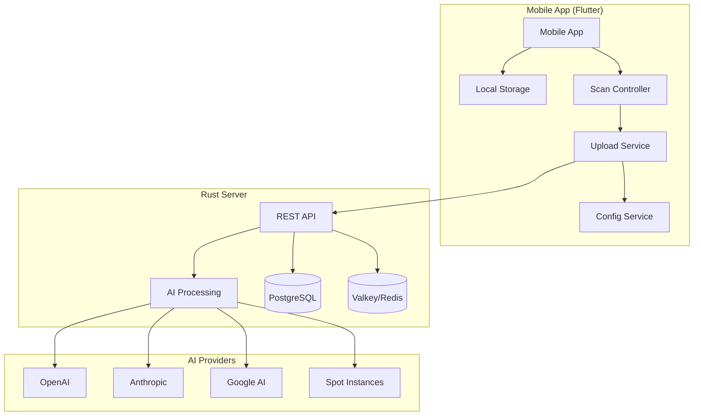

# 🔗 Room-O-Matic Mobile ↔ Rust Server Integration Guide

## Overview

This guide provides comprehensive instructions for integrating the **Room-O-Matic Mobile** Flutter application with the **Room-O-Matic Rust Server**. The mobile app is designed with an **offline-first architecture**, where server integration is optional and only activated when API credentials are configured.

---

## 📋 Table of Contents

1. [Architecture Overview](#architecture-overview)
2. [Server API Endpoints](#server-api-endpoints)
3. [Mobile Configuration](#mobile-configuration)
4. [Authentication & Security](#authentication--security)
5. [Data Synchronization](#data-synchronization)
6. [Upload Workflows](#upload-workflows)
7. [Error Handling](#error-handling)
8. [Performance Optimization](#performance-optimization)
9. [Testing Integration](#testing-integration)
10. [Deployment Considerations](#deployment-considerations)

---

## 🏗️ Architecture Overview

### System Architecture



### Integration Principles

1. **Offline-First**: Mobile app functions completely independently
2. **Optional Server**: Integration only when API credentials are provided
3. **Secure Upload**: All data transmission is encrypted and authenticated
4. **Graceful Degradation**: App continues working if server is unavailable
5. **Incremental Sync**: Only new/changed data is uploaded

---

## 🔌 Server API Endpoints

### Rust Server API Surface

Based on the Rust server implementation plan, the following endpoints are available:

#### Authentication Endpoints

```rust
// POST /api/v1/auth/login
// Request body for API key authentication
{
    "api_key": "romo_live_1234567890abcdef",
    "device_id": "mobile_device_uuid"
}

// Response
{
    "access_token": "jwt_token_here",
    "refresh_token": "refresh_jwt_here",
    "expires_in": 3600,
    "user_id": "user_uuid",
    "quota_remaining": 1000,
    "subscription_tier": "professional"
}
```

#### Room Processing Endpoints

```rust
// POST /api/v1/rooms/upload
// Upload room scan data for AI processing
{
    "room_scan": {
        "id": "scan_uuid",
        "name": "Living Room Scan",
        "timestamp": "2024-12-13T10:30:00Z",
        "device_info": {
            "platform": "iOS",
            "model": "iPhone 15 Pro",
            "os_version": "17.2"
        },
        "sensor_data": {
            "lidar_points": [...],
            "distance_measurements": [...],
            "motion_data": [...],
            "audio_data": [...],
            "environmental_data": [...]
        },
        "measurements": {
            "length": 4.2,
            "width": 3.8,
            "height": 2.4,
            "area": 15.96,
            "volume": 38.304
        }
    }
}

// Response
{
    "processing_id": "proc_uuid",
    "status": "queued",
    "estimated_completion": "2024-12-13T10:35:00Z",
    "cost_estimate": 0.25,
    "quota_consumed": 1
}
```

#### Processing Status Endpoints

```rust
// GET /api/v1/processing/{processing_id}/status
// Response
{
    "processing_id": "proc_uuid",
    "status": "processing", // queued, processing, completed, failed
    "progress": 0.75,
    "provider_used": "openai_gpt4v",
    "cost_actual": 0.23,
    "estimated_completion": "2024-12-13T10:33:00Z",
    "error_message": null
}

// GET /api/v1/processing/{processing_id}/result
// Response (when completed)
{
    "processing_id": "proc_uuid",
    "status": "completed",
    "result": {
        "room_analysis": {
            "room_type": "living_room",
            "features": ["fireplace", "large_windows", "hardwood_floors"],
            "furniture_detected": ["sofa", "coffee_table", "tv_stand"],
            "lighting_conditions": "natural_bright",
            "wall_materials": ["painted_drywall", "brick_accent"]
        },
        "product_recommendations": [
            {
                "category": "furniture",
                "item": "Modern Sectional Sofa",
                "confidence": 0.92,
                "placement_suggestion": {
                    "x": 2.1,
                    "y": 0.0,
                    "z": 1.9,
                    "rotation": 180
                }
            }
        ],
        "3d_scene_data": {
            "vertices": [...],
            "faces": [...],
            "materials": [...]
        }
    },
    "metadata": {
        "processing_time_ms": 4200,
        "provider_used": "openai_gpt4v",
        "cost_actual": 0.23,
        "quota_consumed": 1
    }
}
```

#### User Management Endpoints

```rust
// GET /api/v1/user/profile
// Response
{
    "user_id": "user_uuid",
    "subscription_tier": "professional",
    "quota_limit": 1000,
    "quota_used": 156,
    "quota_reset_date": "2024-01-01T00:00:00Z",
    "api_keys": [
        {
            "id": "key_uuid",
            "name": "Mobile App Key",
            "prefix": "romo_live_1234",
            "created_at": "2024-11-01T00:00:00Z",
            "last_used": "2024-12-13T10:30:00Z"
        }
    ]
}

// GET /api/v1/user/scans
// Response
{
    "scans": [
        {
            "id": "scan_uuid",
            "name": "Living Room Scan",
            "uploaded_at": "2024-12-13T10:30:00Z",
            "processing_status": "completed",
            "cost": 0.23
        }
    ],
    "pagination": {
        "page": 1,
        "per_page": 20,
        "total": 45
    }
}
```

---

## 📱 Mobile Configuration

### Configuration Service Implementation

```dart
// lib/application/services/configuration_service.dart
class ConfigurationService {
  static const String _apiKeyKey = 'room_o_matic_api_key';
  static const String _serverUrlKey = 'room_o_matic_server_url';
  static const String _deviceIdKey = 'room_o_matic_device_id';

  final FlutterSecureStorage _secureStorage;
  final SharedPreferences _prefs;

  ConfigurationService(this._secureStorage, this._prefs);

  /// Check if server integration is configured
  Future<bool> isServerConfigured() async {
    final apiKey = await _secureStorage.read(key: _apiKeyKey);
    final serverUrl = _prefs.getString(_serverUrlKey);
    return apiKey != null &&
           apiKey.isNotEmpty &&
           serverUrl != null &&
           serverUrl.isNotEmpty;
  }

  /// Get API configuration for server requests
  Future<ServerConfig?> getServerConfig() async {
    if (!await isServerConfigured()) return null;

    return ServerConfig(
      apiKey: await _secureStorage.read(key: _apiKeyKey) ?? '',
      serverUrl: _prefs.getString(_serverUrlKey) ?? '',
      deviceId: await _getOrCreateDeviceId(),
    );
  }

  /// Configure server integration
  Future<void> configureServer({
    required String apiKey,
    required String serverUrl,
  }) async {
    // Validate API key format
    if (!_isValidApiKey(apiKey)) {
      throw ConfigurationException('Invalid API key format');
    }

    // Validate server URL
    if (!_isValidServerUrl(serverUrl)) {
      throw ConfigurationException('Invalid server URL format');
    }

    // Store configuration securely
    await _secureStorage.write(key: _apiKeyKey, value: apiKey);
    await _prefs.setString(_serverUrlKey, serverUrl);

    // Test connection
    final testResult = await _testConnection();
    if (!testResult.success) {
      throw ConfigurationException('Connection test failed: ${testResult.error}');
    }
  }

  /// Remove server configuration (go back to offline-only mode)
  Future<void> removeServerConfig() async {
    await _secureStorage.delete(key: _apiKeyKey);
    await _prefs.remove(_serverUrlKey);
  }

  Future<String> _getOrCreateDeviceId() async {
    String? deviceId = await _secureStorage.read(key: _deviceIdKey);
    if (deviceId == null) {
      deviceId = const Uuid().v4();
      await _secureStorage.write(key: _deviceIdKey, value: deviceId);
    }
    return deviceId;
  }

  bool _isValidApiKey(String apiKey) {
    // Room-O-Matic API keys start with 'romo_' and are 32+ characters
    return RegExp(r'^romo_(live|test)_[a-zA-Z0-9]{24,}$').hasMatch(apiKey);
  }

  bool _isValidServerUrl(String url) {
    try {
      final uri = Uri.parse(url);
      return uri.hasScheme && (uri.isScheme('https') || uri.isScheme('http'));
    } catch (e) {
      return false;
    }
  }

  Future<ConnectionTestResult> _testConnection() async {
    try {
      final config = await getServerConfig();
      if (config == null) return ConnectionTestResult.failure('No configuration');

      final response = await http.get(
        Uri.parse('${config.serverUrl}/api/v1/health'),
        headers: {
          'Authorization': 'Bearer ${config.apiKey}',
          'X-Device-ID': config.deviceId,
        },
      ).timeout(const Duration(seconds: 10));

      if (response.statusCode == 200) {
        return ConnectionTestResult.success();
      } else {
        return ConnectionTestResult.failure('HTTP ${response.statusCode}');
      }
    } catch (e) {
      return ConnectionTestResult.failure(e.toString());
    }
  }
}

@freezed
class ServerConfig with _$ServerConfig {
  const factory ServerConfig({
    required String apiKey,
    required String serverUrl,
    required String deviceId,
  }) = _ServerConfig;
}

@freezed
class ConnectionTestResult with _$ConnectionTestResult {
  const factory ConnectionTestResult({
    required bool success,
    String? error,
  }) = _ConnectionTestResult;

  factory ConnectionTestResult.success() => const ConnectionTestResult(success: true);
  factory ConnectionTestResult.failure(String error) => ConnectionTestResult(success: false, error: error);
}
```

### Settings UI for Server Configuration

```dart
// lib/interface/screens/settings/server_configuration_screen.dart
class ServerConfigurationScreen extends ConsumerStatefulWidget {
  @override
  ConsumerState<ServerConfigurationScreen> createState() => _ServerConfigurationScreenState();
}

class _ServerConfigurationScreenState extends ConsumerState<ServerConfigurationScreen> {
  final _formKey = GlobalKey<FormState>();
  final _apiKeyController = TextEditingController();
  final _serverUrlController = TextEditingController();

  bool _isLoading = false;
  bool _showApiKey = false;

  @override
  Widget build(BuildContext context) {
    final configService = ref.watch(configurationServiceProvider);

    return Scaffold(
      appBar: AppBar(
        title: const Text('Server Configuration'),
        elevation: 0,
      ),
      body: SingleChildScrollView(
        padding: const EdgeInsets.all(16),
        child: Form(
          key: _formKey,
          child: Column(
            crossAxisAlignment: CrossAxisAlignment.start,
            children: [
              _buildInfoCard(),
              const SizedBox(height: 24),
              _buildConfigurationForm(),
              const SizedBox(height: 24),
              _buildActionButtons(),
            ],
          ),
        ),
      ),
    );
  }

  Widget _buildInfoCard() {
    return Card(
      child: Padding(
        padding: const EdgeInsets.all(16),
        child: Column(
          crossAxisAlignment: CrossAxisAlignment.start,
          children: [
            Row(
              children: [
                Icon(Icons.info_outline, color: Colors.blue),
                const SizedBox(width: 8),
                Text(
                  'Optional Server Integration',
                  style: Theme.of(context).textTheme.titleMedium?.copyWith(
                    fontWeight: FontWeight.bold,
                  ),
                ),
              ],
            ),
            const SizedBox(height: 12),
            Text(
              'Room-O-Matic Mobile works completely offline. Server integration is optional and provides AI-powered room analysis and product recommendations.',
              style: Theme.of(context).textTheme.bodyMedium,
            ),
            const SizedBox(height: 8),
            Text(
              '• Offline: Complete room measurement and export\n'
              '• Online: AI analysis and product recommendations\n'
              '• Secure: All data encrypted during transmission',
              style: Theme.of(context).textTheme.bodySmall?.copyWith(
                color: Colors.grey[600],
              ),
            ),
          ],
        ),
      ),
    );
  }

  Widget _buildConfigurationForm() {
    return Column(
      crossAxisAlignment: CrossAxisAlignment.start,
      children: [
        Text(
          'Server Configuration',
          style: Theme.of(context).textTheme.titleLarge,
        ),
        const SizedBox(height: 16),

        // Server URL Field
        TextFormField(
          controller: _serverUrlController,
          decoration: const InputDecoration(
            labelText: 'Server URL',
            hintText: 'https://api.room-o-matic.com',
            prefixIcon: Icon(Icons.link),
            border: OutlineInputBorder(),
          ),
          validator: (value) {
            if (value == null || value.isEmpty) {
              return 'Please enter server URL';
            }
            if (!Uri.tryParse(value)?.hasScheme == true) {
              return 'Please enter a valid URL';
            }
            return null;
          },
        ),
        const SizedBox(height: 16),

        // API Key Field
        TextFormField(
          controller: _apiKeyController,
          obscureText: !_showApiKey,
          decoration: InputDecoration(
            labelText: 'API Key',
            hintText: 'romo_live_...',
            prefixIcon: const Icon(Icons.key),
            suffixIcon: IconButton(
              icon: Icon(_showApiKey ? Icons.visibility_off : Icons.visibility),
              onPressed: () => setState(() => _showApiKey = !_showApiKey),
            ),
            border: const OutlineInputBorder(),
          ),
          validator: (value) {
            if (value == null || value.isEmpty) {
              return 'Please enter API key';
            }
            if (!RegExp(r'^romo_(live|test)_[a-zA-Z0-9]{24,}$').hasMatch(value)) {
              return 'Invalid API key format';
            }
            return null;
          },
        ),
      ],
    );
  }

  Widget _buildActionButtons() {
    return Column(
      children: [
        SizedBox(
          width: double.infinity,
          child: ElevatedButton.icon(
            onPressed: _isLoading ? null : _testAndSaveConfiguration,
            icon: _isLoading
                ? const SizedBox(
                    width: 20,
                    height: 20,
                    child: CircularProgressIndicator(strokeWidth: 2),
                  )
                : const Icon(Icons.save),
            label: Text(_isLoading ? 'Testing Connection...' : 'Save Configuration'),
            style: ElevatedButton.styleFrom(
              backgroundColor: Colors.green,
              foregroundColor: Colors.white,
              padding: const EdgeInsets.symmetric(vertical: 16),
            ),
          ),
        ),
        const SizedBox(height: 12),
        SizedBox(
          width: double.infinity,
          child: OutlinedButton.icon(
            onPressed: _isLoading ? null : _removeConfiguration,
            icon: const Icon(Icons.delete_outline),
            label: const Text('Remove Configuration (Offline Only)'),
            style: OutlinedButton.styleFrom(
              foregroundColor: Colors.red,
              side: const BorderSide(color: Colors.red),
              padding: const EdgeInsets.symmetric(vertical: 16),
            ),
          ),
        ),
      ],
    );
  }

  Future<void> _testAndSaveConfiguration() async {
    if (!_formKey.currentState!.validate()) return;

    setState(() => _isLoading = true);

    try {
      final configService = ref.read(configurationServiceProvider);

      await configService.configureServer(
        apiKey: _apiKeyController.text.trim(),
        serverUrl: _serverUrlController.text.trim(),
      );

      if (mounted) {
        ScaffoldMessenger.of(context).showSnackBar(
          const SnackBar(
            content: Text('✅ Server configuration saved successfully!'),
            backgroundColor: Colors.green,
          ),
        );
        Navigator.of(context).pop();
      }
    } catch (e) {
      if (mounted) {
        ScaffoldMessenger.of(context).showSnackBar(
          SnackBar(
            content: Text('❌ Configuration failed: $e'),
            backgroundColor: Colors.red,
          ),
        );
      }
    } finally {
      if (mounted) {
        setState(() => _isLoading = false);
      }
    }
  }

  Future<void> _removeConfiguration() async {
    final confirmed = await showDialog<bool>(
      context: context,
      builder: (context) => AlertDialog(
        title: const Text('Remove Server Configuration'),
        content: const Text(
          'This will remove the server configuration and return to offline-only mode. '
          'Your local scan data will not be affected.',
        ),
        actions: [
          TextButton(
            onPressed: () => Navigator.of(context).pop(false),
            child: const Text('Cancel'),
          ),
          ElevatedButton(
            onPressed: () => Navigator.of(context).pop(true),
            style: ElevatedButton.styleFrom(backgroundColor: Colors.red),
            child: const Text('Remove'),
          ),
        ],
      ),
    );

    if (confirmed == true) {
      final configService = ref.read(configurationServiceProvider);
      await configService.removeServerConfig();

      if (mounted) {
        ScaffoldMessenger.of(context).showSnackBar(
          const SnackBar(
            content: Text('Server configuration removed. App is now offline-only.'),
          ),
        );
        Navigator.of(context).pop();
      }
    }
  }
}
```

---

## 🔐 Authentication & Security

### API Key Authentication

```dart
// lib/infrastructure/auth/api_auth_service.dart
class ApiAuthService {
  final Dio _dio;
  final ConfigurationService _configService;
  final FlutterSecureStorage _secureStorage;

  static const String _accessTokenKey = 'room_o_matic_access_token';
  static const String _refreshTokenKey = 'room_o_matic_refresh_token';

  ApiAuthService(this._dio, this._configService, this._secureStorage);

  /// Authenticate with the server using API key
  Future<AuthResult> authenticate() async {
    try {
      final config = await _configService.getServerConfig();
      if (config == null) {
        return AuthResult.failure('Server not configured');
      }

      final response = await _dio.post(
        '${config.serverUrl}/api/v1/auth/login',
        data: {
          'api_key': config.apiKey,
          'device_id': config.deviceId,
        },
      );

      final authData = AuthResponse.fromJson(response.data);

      // Store tokens securely
      await _secureStorage.write(key: _accessTokenKey, value: authData.accessToken);
      await _secureStorage.write(key: _refreshTokenKey, value: authData.refreshToken);

      // Setup automatic token refresh
      _scheduleTokenRefresh(authData.expiresIn);

      return AuthResult.success(authData);
    } catch (e) {
      return AuthResult.failure(e.toString());
    }
  }

  /// Get valid access token (refresh if needed)
  Future<String?> getValidAccessToken() async {
    final token = await _secureStorage.read(key: _accessTokenKey);
    if (token == null) return null;

    // Check if token is expired (implement JWT parsing)
    if (_isTokenExpired(token)) {
      final refreshResult = await _refreshToken();
      if (refreshResult.success) {
        return refreshResult.authData?.accessToken;
      }
      return null;
    }

    return token;
  }

  /// Refresh expired access token
  Future<AuthResult> _refreshToken() async {
    try {
      final refreshToken = await _secureStorage.read(key: _refreshTokenKey);
      if (refreshToken == null) {
        return AuthResult.failure('No refresh token available');
      }

      final config = await _configService.getServerConfig();
      if (config == null) {
        return AuthResult.failure('Server not configured');
      }

      final response = await _dio.post(
        '${config.serverUrl}/api/v1/auth/refresh',
        data: {
          'refresh_token': refreshToken,
          'device_id': config.deviceId,
        },
      );

      final authData = AuthResponse.fromJson(response.data);

      // Update stored tokens
      await _secureStorage.write(key: _accessTokenKey, value: authData.accessToken);
      await _secureStorage.write(key: _refreshTokenKey, value: authData.refreshToken);

      return AuthResult.success(authData);
    } catch (e) {
      // Refresh failed, clear tokens
      await _clearTokens();
      return AuthResult.failure(e.toString());
    }
  }

  /// Clear stored authentication tokens
  Future<void> _clearTokens() async {
    await _secureStorage.delete(key: _accessTokenKey);
    await _secureStorage.delete(key: _refreshTokenKey);
  }

  void _scheduleTokenRefresh(int expiresIn) {
    // Schedule refresh 5 minutes before expiration
    final refreshDelay = Duration(seconds: expiresIn - 300);
    Timer(refreshDelay, () => _refreshToken());
  }

  bool _isTokenExpired(String token) {
    try {
      // Parse JWT token to check expiration
      final parts = token.split('.');
      if (parts.length != 3) return true;

      final payload = json.decode(
        utf8.decode(base64Url.decode(base64Url.normalize(parts[1]))),
      );

      final exp = payload['exp'] as int?;
      if (exp == null) return true;

      final expirationDate = DateTime.fromMillisecondsSinceEpoch(exp * 1000);
      return DateTime.now().isAfter(expirationDate);
    } catch (e) {
      return true; // Assume expired if parsing fails
    }
  }
}

@freezed
class AuthResult with _$AuthResult {
  const factory AuthResult({
    required bool success,
    AuthResponse? authData,
    String? error,
  }) = _AuthResult;

  factory AuthResult.success(AuthResponse authData) => AuthResult(success: true, authData: authData);
  factory AuthResult.failure(String error) => AuthResult(success: false, error: error);
}

@freezed
class AuthResponse with _$AuthResponse {
  const factory AuthResponse({
    required String accessToken,
    required String refreshToken,
    required int expiresIn,
    required String userId,
    required int quotaRemaining,
    required String subscriptionTier,
  }) = _AuthResponse;

  factory AuthResponse.fromJson(Map<String, dynamic> json) => _$AuthResponseFromJson(json);
}
```

### HTTP Client with Authentication

```dart
// lib/infrastructure/http/authenticated_http_client.dart
class AuthenticatedHttpClient {
  final Dio _dio;
  final ApiAuthService _authService;

  AuthenticatedHttpClient(this._authService) : _dio = Dio() {
    _setupInterceptors();
  }

  void _setupInterceptors() {
    // Request interceptor to add authentication
    _dio.interceptors.add(
      InterceptorsWrapper(
        onRequest: (options, handler) async {
          final token = await _authService.getValidAccessToken();
          if (token != null) {
            options.headers['Authorization'] = 'Bearer $token';
          }

          final config = await _configService.getServerConfig();
          if (config != null) {
            options.headers['X-Device-ID'] = config.deviceId;
          }

          handler.next(options);
        },
        onError: (error, handler) async {
          // Handle 401 unauthorized by re-authenticating
          if (error.response?.statusCode == 401) {
            final authResult = await _authService.authenticate();
            if (authResult.success) {
              // Retry the original request
              final retryResponse = await _dio.request(
                error.requestOptions.path,
                options: Options(
                  method: error.requestOptions.method,
                  headers: {
                    ...error.requestOptions.headers,
                    'Authorization': 'Bearer ${authResult.authData!.accessToken}',
                  },
                ),
                data: error.requestOptions.data,
                queryParameters: error.requestOptions.queryParameters,
              );
              handler.resolve(retryResponse);
              return;
            }
          }
          handler.next(error);
        },
      ),
    );

    // Logging interceptor for debugging
    _dio.interceptors.add(LogInterceptor(
      requestBody: true,
      responseBody: true,
      logPrint: (object) => debugPrint('HTTP: $object'),
    ));
  }

  /// Upload room scan data to server
  Future<UploadResponse> uploadRoomScan(RoomScanData scanData) async {
    try {
      final config = await _configService.getServerConfig();
      if (config == null) {
        throw Exception('Server not configured');
      }

      final response = await _dio.post(
        '${config.serverUrl}/api/v1/rooms/upload',
        data: scanData.toJson(),
      );

      return UploadResponse.fromJson(response.data);
    } catch (e) {
      rethrow;
    }
  }

  /// Check processing status
  Future<ProcessingStatus> getProcessingStatus(String processingId) async {
    try {
      final config = await _configService.getServerConfig();
      if (config == null) {
        throw Exception('Server not configured');
      }

      final response = await _dio.get(
        '${config.serverUrl}/api/v1/processing/$processingId/status',
      );

      return ProcessingStatus.fromJson(response.data);
    } catch (e) {
      rethrow;
    }
  }

  /// Get processing results
  Future<ProcessingResult> getProcessingResult(String processingId) async {
    try {
      final config = await _configService.getServerConfig();
      if (config == null) {
        throw Exception('Server not configured');
      }

      final response = await _dio.get(
        '${config.serverUrl}/api/v1/processing/$processingId/result',
      );

      return ProcessingResult.fromJson(response.data);
    } catch (e) {
      rethrow;
    }
  }
}
```

---

## 🔄 Data Synchronization

### Upload Service Implementation

```dart
// lib/infrastructure/upload/room_scan_upload_service.dart
class RoomScanUploadService {
  final AuthenticatedHttpClient _httpClient;
  final RoomScanRepository _localRepository;
  final ConfigurationService _configService;

  RoomScanUploadService(
    this._httpClient,
    this._localRepository,
    this._configService,
  );

  /// Upload a single room scan to the server
  Future<UploadResult> uploadRoomScan(String scanId) async {
    try {
      // Check if server is configured
      if (!await _configService.isServerConfigured()) {
        return UploadResult.failure('Server not configured');
      }

      // Get scan data from local storage
      final scan = await _localRepository.getRoomScanById(scanId);
      if (scan == null) {
        return UploadResult.failure('Scan not found');
      }

      // Convert to upload format
      final uploadData = await _convertToUploadFormat(scan);

      // Upload to server
      final response = await _httpClient.uploadRoomScan(uploadData);

      // Update local record with upload status
      await _localRepository.updateUploadStatus(
        scanId,
        UploadStatus.uploaded(
          processingId: response.processingId,
          uploadedAt: DateTime.now(),
        ),
      );

      // Start monitoring processing status
      _monitorProcessingStatus(response.processingId, scanId);

      return UploadResult.success(response);
    } catch (e) {
      await _localRepository.updateUploadStatus(
        scanId,
        UploadStatus.failed(error: e.toString()),
      );
      return UploadResult.failure(e.toString());
    }
  }

  /// Upload all pending scans
  Future<BatchUploadResult> uploadPendingScans() async {
    final pendingScans = await _localRepository.getPendingUploadScans();
    final results = <String, UploadResult>{};

    for (final scan in pendingScans) {
      final result = await uploadRoomScan(scan.id);
      results[scan.id] = result;

      // Add delay between uploads to avoid rate limiting
      await Future.delayed(const Duration(milliseconds: 500));
    }

    final successCount = results.values.where((r) => r.success).length;
    final failureCount = results.values.where((r) => !r.success).length;

    return BatchUploadResult(
      totalScans: pendingScans.length,
      successCount: successCount,
      failureCount: failureCount,
      results: results,
    );
  }

  /// Monitor processing status and update local record
  void _monitorProcessingStatus(String processingId, String scanId) {
    Timer.periodic(const Duration(seconds: 5), (timer) async {
      try {
        final status = await _httpClient.getProcessingStatus(processingId);

        await _localRepository.updateProcessingStatus(scanId, status);

        if (status.isCompleted || status.isFailed) {
          timer.cancel();

          if (status.isCompleted) {
            // Fetch and store results
            final result = await _httpClient.getProcessingResult(processingId);
            await _localRepository.updateProcessingResult(scanId, result);
          }
        }
      } catch (e) {
        // Continue monitoring despite errors
        debugPrint('Error monitoring processing status: $e');
      }
    });
  }

  Future<RoomScanData> _convertToUploadFormat(RoomScan scan) async {
    return RoomScanData(
      roomScan: RoomScanUpload(
        id: scan.id,
        name: scan.name,
        timestamp: scan.timestamp,
        deviceInfo: DeviceInfo(
          platform: Platform.isIOS ? 'iOS' : 'Android',
          model: await _getDeviceModel(),
          osVersion: await _getOSVersion(),
        ),
        sensorData: SensorDataCollection(
          lidarPoints: scan.lidarData?.points ?? [],
          distanceMeasurements: scan.distanceMeasurements
              .map((m) => m.toUploadFormat())
              .toList(),
          motionData: scan.motionData
              .map((m) => m.toUploadFormat())
              .toList(),
          audioData: scan.audioData
              .map((a) => a.toUploadFormat())
              .toList(),
          environmentalData: scan.environmentalData
              .map((e) => e.toUploadFormat())
              .toList(),
        ),
        measurements: RoomMeasurements(
          length: scan.dimensions.length,
          width: scan.dimensions.width,
          height: scan.dimensions.height,
          area: scan.dimensions.area,
          volume: scan.dimensions.volume,
        ),
      ),
    );
  }
}

@freezed
class UploadResult with _$UploadResult {
  const factory UploadResult({
    required bool success,
    UploadResponse? response,
    String? error,
  }) = _UploadResult;

  factory UploadResult.success(UploadResponse response) =>
      UploadResult(success: true, response: response);
  factory UploadResult.failure(String error) =>
      UploadResult(success: false, error: error);
}

@freezed
class BatchUploadResult with _$BatchUploadResult {
  const factory BatchUploadResult({
    required int totalScans,
    required int successCount,
    required int failureCount,
    required Map<String, UploadResult> results,
  }) = _BatchUploadResult;
}
```

### Background Upload Service

```dart
// lib/infrastructure/background/background_upload_service.dart
class BackgroundUploadService {
  final RoomScanUploadService _uploadService;
  final ConfigurationService _configService;

  Timer? _uploadTimer;
  bool _isUploading = false;

  BackgroundUploadService(this._uploadService, this._configService);

  /// Start automatic background uploads
  void startBackgroundUploads() {
    _uploadTimer?.cancel();
    _uploadTimer = Timer.periodic(
      const Duration(minutes: 5),
      (_) => _performBackgroundUpload(),
    );
  }

  /// Stop automatic background uploads
  void stopBackgroundUploads() {
    _uploadTimer?.cancel();
    _uploadTimer = null;
  }

  Future<void> _performBackgroundUpload() async {
    if (_isUploading) return;
    if (!await _configService.isServerConfigured()) return;

    _isUploading = true;

    try {
      await _uploadService.uploadPendingScans();
    } catch (e) {
      debugPrint('Background upload failed: $e');
    } finally {
      _isUploading = false;
    }
  }

  void dispose() {
    stopBackgroundUploads();
  }
}
```

---

## ⚠️ Error Handling

### Comprehensive Error Handling

```dart
// lib/infrastructure/upload/upload_error_handler.dart
class UploadErrorHandler {
  static UploadError handleError(dynamic error) {
    if (error is DioException) {
      return _handleDioError(error);
    } else if (error is SocketException) {
      return UploadError.networkError('No internet connection');
    } else if (error is TimeoutException) {
      return UploadError.networkError('Request timeout');
    } else {
      return UploadError.unknown(error.toString());
    }
  }

  static UploadError _handleDioError(DioException error) {
    switch (error.type) {
      case DioExceptionType.connectionTimeout:
      case DioExceptionType.sendTimeout:
      case DioExceptionType.receiveTimeout:
        return UploadError.networkError('Connection timeout');

      case DioExceptionType.badResponse:
        return _handleHttpError(error.response);

      case DioExceptionType.cancel:
        return UploadError.cancelled('Upload cancelled');

      case DioExceptionType.connectionError:
        return UploadError.networkError('Connection error');

      default:
        return UploadError.unknown(error.message ?? 'Unknown error');
    }
  }

  static UploadError _handleHttpError(Response? response) {
    if (response == null) {
      return UploadError.unknown('No response received');
    }

    switch (response.statusCode) {
      case 400:
        return UploadError.validation('Invalid request data');
      case 401:
        return UploadError.authentication('Authentication failed');
      case 403:
        return UploadError.authorization('Access denied');
      case 404:
        return UploadError.notFound('Endpoint not found');
      case 429:
        return UploadError.rateLimited('Too many requests');
      case 500:
      case 502:
      case 503:
      case 504:
        return UploadError.serverError('Server error');
      default:
        return UploadError.unknown('HTTP ${response.statusCode}');
    }
  }
}

@freezed
class UploadError with _$UploadError {
  const factory UploadError.networkError(String message) = NetworkError;
  const factory UploadError.authentication(String message) = AuthenticationError;
  const factory UploadError.authorization(String message) = AuthorizationError;
  const factory UploadError.validation(String message) = ValidationError;
  const factory UploadError.rateLimited(String message) = RateLimitedError;
  const factory UploadError.serverError(String message) = ServerError;
  const factory UploadError.notFound(String message) = NotFoundError;
  const factory UploadError.cancelled(String message) = CancelledError;
  const factory UploadError.unknown(String message) = UnknownError;
}
```

### User-Friendly Error Display

```dart
// lib/interface/widgets/upload_error_widget.dart
class UploadErrorWidget extends StatelessWidget {
  final UploadError error;
  final VoidCallback? onRetry;
  final VoidCallback? onDismiss;

  const UploadErrorWidget({
    Key? key,
    required this.error,
    this.onRetry,
    this.onDismiss,
  }) : super(key: key);

  @override
  Widget build(BuildContext context) {
    return Card(
      color: Colors.red[50],
      child: Padding(
        padding: const EdgeInsets.all(16),
        child: Column(
          crossAxisAlignment: CrossAxisAlignment.start,
          mainAxisSize: MainAxisSize.min,
          children: [
            Row(
              children: [
                Icon(
                  _getErrorIcon(),
                  color: Colors.red,
                  size: 24,
                ),
                const SizedBox(width: 12),
                Expanded(
                  child: Text(
                    _getErrorTitle(),
                    style: const TextStyle(
                      fontSize: 16,
                      fontWeight: FontWeight.bold,
                      color: Colors.red,
                    ),
                  ),
                ),
                if (onDismiss != null)
                  IconButton(
                    onPressed: onDismiss,
                    icon: const Icon(Icons.close),
                    iconSize: 20,
                    color: Colors.grey,
                  ),
              ],
            ),
            const SizedBox(height: 8),
            Text(
              _getErrorMessage(),
              style: const TextStyle(fontSize: 14),
            ),
            if (_shouldShowRetryButton()) ...[
              const SizedBox(height: 12),
              Row(
                mainAxisAlignment: MainAxisAlignment.end,
                children: [
                  TextButton.icon(
                    onPressed: onRetry,
                    icon: const Icon(Icons.refresh),
                    label: const Text('Retry Upload'),
                  ),
                ],
              ),
            ],
          ],
        ),
      ),
    );
  }

  IconData _getErrorIcon() {
    return error.when(
      networkError: (_) => Icons.wifi_off,
      authentication: (_) => Icons.lock,
      authorization: (_) => Icons.block,
      validation: (_) => Icons.error,
      rateLimited: (_) => Icons.timer,
      serverError: (_) => Icons.dns,
      notFound: (_) => Icons.search_off,
      cancelled: (_) => Icons.cancel,
      unknown: (_) => Icons.error_outline,
    );
  }

  String _getErrorTitle() {
    return error.when(
      networkError: (_) => 'Connection Error',
      authentication: (_) => 'Authentication Failed',
      authorization: (_) => 'Access Denied',
      validation: (_) => 'Invalid Data',
      rateLimited: (_) => 'Rate Limited',
      serverError: (_) => 'Server Error',
      notFound: (_) => 'Service Not Found',
      cancelled: (_) => 'Upload Cancelled',
      unknown: (_) => 'Upload Error',
    );
  }

  String _getErrorMessage() {
    return error.when(
      networkError: (msg) => 'Please check your internet connection and try again. $msg',
      authentication: (msg) => 'Please check your API key configuration. $msg',
      authorization: (msg) => 'You do not have permission for this operation. $msg',
      validation: (msg) => 'The scan data is invalid. $msg',
      rateLimited: (msg) => 'Too many uploads. Please wait before trying again. $msg',
      serverError: (msg) => 'The server is experiencing issues. Please try again later. $msg',
      notFound: (msg) => 'The upload service is not available. $msg',
      cancelled: (msg) => 'The upload was cancelled. $msg',
      unknown: (msg) => 'An unexpected error occurred: $msg',
    );
  }

  bool _shouldShowRetryButton() {
    return error.when(
      networkError: (_) => true,
      authentication: (_) => false, // Need to fix config first
      authorization: (_) => false, // Need admin intervention
      validation: (_) => false, // Data issue
      rateLimited: (_) => true,
      serverError: (_) => true,
      notFound: (_) => false,
      cancelled: (_) => true,
      unknown: (_) => true,
    );
  }
}
```

---

## 🚀 Performance Optimization

### Upload Queue Management

```dart
// lib/infrastructure/upload/upload_queue_manager.dart
class UploadQueueManager {
  final RoomScanUploadService _uploadService;
  final ConnectivityService _connectivityService;

  final Queue<String> _uploadQueue = Queue<String>();
  final Set<String> _uploading = <String>{};
  final StreamController<UploadQueueState> _stateController =
      StreamController<UploadQueueState>.broadcast();

  static const int _maxConcurrentUploads = 2;
  bool _isProcessing = false;

  UploadQueueManager(this._uploadService, this._connectivityService) {
    _connectivityService.connectivityStream.listen(_onConnectivityChanged);
  }

  Stream<UploadQueueState> get stateStream => _stateController.stream;

  /// Add scan to upload queue
  void enqueueUpload(String scanId) {
    if (!_uploadQueue.contains(scanId) && !_uploading.contains(scanId)) {
      _uploadQueue.add(scanId);
      _updateState();
      _processQueue();
    }
  }

  /// Remove scan from upload queue
  void dequeueUpload(String scanId) {
    _uploadQueue.remove(scanId);
    _updateState();
  }

  /// Process the upload queue
  Future<void> _processQueue() async {
    if (_isProcessing || !_connectivityService.hasConnection) {
      return;
    }

    _isProcessing = true;

    while (_uploadQueue.isNotEmpty &&
           _uploading.length < _maxConcurrentUploads &&
           _connectivityService.hasConnection) {

      final scanId = _uploadQueue.removeFirst();
      _uploading.add(scanId);
      _updateState();

      // Process upload in background
      _processUpload(scanId);
    }

    _isProcessing = false;
  }

  Future<void> _processUpload(String scanId) async {
    try {
      final result = await _uploadService.uploadRoomScan(scanId);

      if (result.success) {
        _uploading.remove(scanId);
        _updateState();

        // Continue processing queue
        _processQueue();
      } else {
        // Retry failed uploads
        _uploading.remove(scanId);
        _uploadQueue.addFirst(scanId); // Add back to front of queue
        _updateState();

        // Wait before retry
        await Future.delayed(const Duration(seconds: 30));
        _processQueue();
      }
    } catch (e) {
      _uploading.remove(scanId);
      _uploadQueue.addFirst(scanId); // Add back to front of queue
      _updateState();

      // Wait before retry
      await Future.delayed(const Duration(seconds: 30));
      _processQueue();
    }
  }

  void _onConnectivityChanged(bool hasConnection) {
    if (hasConnection) {
      _processQueue();
    }
  }

  void _updateState() {
    _stateController.add(
      UploadQueueState(
        queueLength: _uploadQueue.length,
        uploadingCount: _uploading.length,
        hasConnection: _connectivityService.hasConnection,
      ),
    );
  }

  void dispose() {
    _stateController.close();
  }
}

@freezed
class UploadQueueState with _$UploadQueueState {
  const factory UploadQueueState({
    required int queueLength,
    required int uploadingCount,
    required bool hasConnection,
  }) = _UploadQueueState;
}
```

### Data Compression

```dart
// lib/infrastructure/upload/data_compression_service.dart
class DataCompressionService {
  /// Compress room scan data before upload
  static Future<Uint8List> compressRoomScanData(RoomScanData data) async {
    final jsonString = jsonEncode(data.toJson());
    final jsonBytes = utf8.encode(jsonString);

    // Use gzip compression
    final compressedBytes = await compute(_compressData, jsonBytes);

    return compressedBytes;
  }

  /// Decompress room scan data after download
  static Future<RoomScanData> decompressRoomScanData(Uint8List compressedData) async {
    final decompressedBytes = await compute(_decompressData, compressedData);
    final jsonString = utf8.decode(decompressedBytes);
    final jsonMap = jsonDecode(jsonString) as Map<String, dynamic>;

    return RoomScanData.fromJson(jsonMap);
  }

  static Uint8List _compressData(Uint8List data) {
    return Uint8List.fromList(gzip.encode(data));
  }

  static Uint8List _decompressData(Uint8List compressedData) {
    return Uint8List.fromList(gzip.decode(compressedData));
  }

  /// Estimate compression ratio for UI display
  static double estimateCompressionRatio(RoomScanData data) {
    final jsonString = jsonEncode(data.toJson());
    final originalSize = utf8.encode(jsonString).length;

    // Estimate based on typical compression ratios for JSON data
    return 0.3; // Assume 70% reduction
  }
}
```

---

## 🧪 Testing Integration

### Mock Server for Testing

```dart
// test/mocks/mock_server_client.dart
class MockServerClient extends Mock implements AuthenticatedHttpClient {
  final Map<String, ProcessingResult> _mockResults = {};
  final Map<String, ProcessingStatus> _mockStatuses = {};

  @override
  Future<UploadResponse> uploadRoomScan(RoomScanData scanData) async {
    // Simulate upload delay
    await Future.delayed(const Duration(milliseconds: 500));

    final processingId = const Uuid().v4();

    // Set initial status
    _mockStatuses[processingId] = ProcessingStatus(
      processingId: processingId,
      status: 'queued',
      progress: 0.0,
      providerUsed: 'mock_provider',
      costActual: 0.25,
      estimatedCompletion: DateTime.now().add(const Duration(minutes: 5)),
      errorMessage: null,
    );

    // Simulate processing completion after delay
    Timer(const Duration(seconds: 10), () {
      _mockStatuses[processingId] = ProcessingStatus(
        processingId: processingId,
        status: 'completed',
        progress: 1.0,
        providerUsed: 'mock_provider',
        costActual: 0.23,
        estimatedCompletion: DateTime.now(),
        errorMessage: null,
      );

      _mockResults[processingId] = ProcessingResult(
        processingId: processingId,
        status: 'completed',
        result: ProcessingResultData(
          roomAnalysis: RoomAnalysis(
            roomType: 'living_room',
            features: ['fireplace', 'large_windows'],
            furnitureDetected: ['sofa', 'coffee_table'],
            lightingConditions: 'natural_bright',
            wallMaterials: ['painted_drywall'],
          ),
          productRecommendations: [
            ProductRecommendation(
              category: 'furniture',
              item: 'Modern Sectional Sofa',
              confidence: 0.92,
              placementSuggestion: PlacementSuggestion(
                x: 2.1,
                y: 0.0,
                z: 1.9,
                rotation: 180,
              ),
            ),
          ],
          sceneData: Scene3DData(
            vertices: [],
            faces: [],
            materials: [],
          ),
        ),
        metadata: ProcessingMetadata(
          processingTimeMs: 4200,
          providerUsed: 'mock_provider',
          costActual: 0.23,
          quotaConsumed: 1,
        ),
      );
    });

    return UploadResponse(
      processingId: processingId,
      status: 'queued',
      estimatedCompletion: DateTime.now().add(const Duration(minutes: 5)),
      costEstimate: 0.25,
      quotaConsumed: 1,
    );
  }

  @override
  Future<ProcessingStatus> getProcessingStatus(String processingId) async {
    await Future.delayed(const Duration(milliseconds: 200));

    return _mockStatuses[processingId] ??
        ProcessingStatus(
          processingId: processingId,
          status: 'not_found',
          progress: 0.0,
          providerUsed: null,
          costActual: null,
          estimatedCompletion: null,
          errorMessage: 'Processing not found',
        );
  }

  @override
  Future<ProcessingResult> getProcessingResult(String processingId) async {
    await Future.delayed(const Duration(milliseconds: 200));

    final result = _mockResults[processingId];
    if (result == null) {
      throw Exception('Processing result not found');
    }

    return result;
  }
}
```

### Integration Tests

```dart
// test/integration/server_integration_test.dart
void main() {
  group('Server Integration Tests', () {
    late ConfigurationService configService;
    late RoomScanUploadService uploadService;
    late MockServerClient mockClient;

    setUp(() {
      mockClient = MockServerClient();
      configService = ConfigurationService(
        FlutterSecureStorage(),
        MockSharedPreferences(),
      );
      uploadService = RoomScanUploadService(
        mockClient,
        MockRoomScanRepository(),
        configService,
      );
    });

    testWidgets('Should upload room scan when server is configured', (tester) async {
      // Configure mock server
      await configService.configureServer(
        apiKey: 'romo_test_1234567890abcdef',
        serverUrl: 'https://api.room-o-matic.com',
      );

      // Create test scan data
      final scanId = const Uuid().v4();

      // Upload scan
      final result = await uploadService.uploadRoomScan(scanId);

      // Verify upload was successful
      expect(result.success, isTrue);
      expect(result.response?.processingId, isNotNull);
    });

    testWidgets('Should handle server errors gracefully', (tester) async {
      // Configure mock to simulate server error
      when(mockClient.uploadRoomScan(any)).thenThrow(
        DioException(
          requestOptions: RequestOptions(path: '/api/v1/rooms/upload'),
          response: Response(
            statusCode: 500,
            requestOptions: RequestOptions(path: '/api/v1/rooms/upload'),
          ),
        ),
      );

      // Attempt upload
      final result = await uploadService.uploadRoomScan('test_scan_id');

      // Verify error handling
      expect(result.success, isFalse);
      expect(result.error, contains('Server error'));
    });

    testWidgets('Should work offline when server not configured', (tester) async {
      // Ensure no server configuration
      await configService.removeServerConfig();

      // App should continue working in offline mode
      final isConfigured = await configService.isServerConfigured();
      expect(isConfigured, isFalse);

      // Upload should return appropriate error
      final result = await uploadService.uploadRoomScan('test_scan_id');
      expect(result.success, isFalse);
      expect(result.error, contains('Server not configured'));
    });
  });
}
```

---

## 🚀 Deployment Considerations

### Environment Configuration

```yaml
# pubspec.yaml - Environment-specific configurations
flutter:
  assets:
    - assets/config/dev.json
    - assets/config/staging.json
    - assets/config/production.json
```

```dart
// lib/infrastructure/config/environment_config.dart
class EnvironmentConfig {
  static const String _environment = String.fromEnvironment('ENVIRONMENT', defaultValue: 'dev');

  static Future<Map<String, dynamic>> loadConfig() async {
    final configString = await rootBundle.loadString('assets/config/$_environment.json');
    return jsonDecode(configString) as Map<String, dynamic>;
  }

  static String get defaultServerUrl {
    switch (_environment) {
      case 'production':
        return 'https://api.room-o-matic.com';
      case 'staging':
        return 'https://staging-api.room-o-matic.com';
      default:
        return 'https://dev-api.room-o-matic.com';
    }
  }
}
```

### CI/CD Integration

```yaml
# .github/workflows/test_server_integration.yml
name: Test Server Integration

on:
  push:
    branches: [ main, develop ]
  pull_request:
    branches: [ main ]

jobs:
  test-integration:
    runs-on: ubuntu-latest

    steps:
    - uses: actions/checkout@v3

    - name: Setup Flutter
      uses: subosito/flutter-action@v2
      with:
        flutter-version: '3.24.0'

    - name: Install dependencies
      run: flutter pub get

    - name: Run integration tests
      env:
        RUST_SERVER_URL: ${{ secrets.TEST_SERVER_URL }}
        TEST_API_KEY: ${{ secrets.TEST_API_KEY }}
      run: flutter test test/integration/

    - name: Upload test results
      uses: actions/upload-artifact@v3
      if: always()
      with:
        name: test-results
        path: test/reports/
```

### Security Considerations

1. **API Key Storage**: Always use secure storage (Keychain/Keystore)
2. **Certificate Pinning**: Implement for production API calls
3. **Request Signing**: Add HMAC signatures for sensitive requests
4. **Data Encryption**: Encrypt all sensor data before upload
5. **Network Security**: Use TLS 1.3 with proper certificate validation

### Performance Monitoring

```dart
// lib/infrastructure/monitoring/performance_monitor.dart
class PerformanceMonitor {
  static void trackUpload({
    required String scanId,
    required int dataSize,
    required Duration uploadTime,
    required bool success,
  }) {
    // Track metrics for performance analysis
    FirebasePerformance.instance.newTrace('room_scan_upload')
      ..putAttribute('scan_id', scanId)
      ..putAttribute('data_size_mb', (dataSize / 1024 / 1024).toString())
      ..putAttribute('success', success.toString())
      ..stop();
  }

  static void trackProcessingTime({
    required String processingId,
    required Duration processingTime,
    required String provider,
  }) {
    FirebasePerformance.instance.newTrace('ai_processing')
      ..putAttribute('processing_id', processingId)
      ..putAttribute('provider', provider)
      ..putAttribute('duration_ms', processingTime.inMilliseconds.toString())
      ..stop();
  }
}
```

---

## 📋 Summary

This guide provides a comprehensive framework for integrating the Room-O-Matic Mobile app with the Rust server while maintaining the offline-first architecture. Key takeaways:

1. **Optional Integration**: Server functionality is purely optional and doesn't affect core app functionality
2. **Security First**: All communication is encrypted and authenticated
3. **Graceful Degradation**: App continues working if server is unavailable
4. **Performance Optimized**: Background uploads, compression, and queue management
5. **Error Resilient**: Comprehensive error handling with user-friendly messages
6. **Testing Ready**: Mock implementations and integration tests included

The mobile app provides complete room measurement and export capabilities offline, with optional AI-powered analysis and product recommendations when connected to the Rust server.
